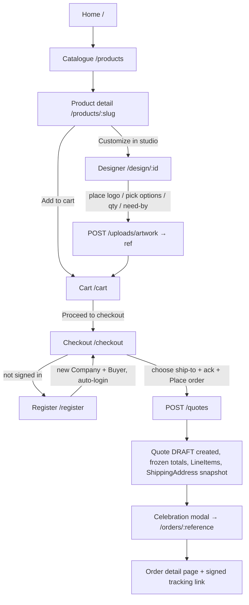

# WF-01 — Buyer Purchase Journey

**Actors:** Anonymous visitor → self-registered Buyer.
**Goal:** browse a product, customize it, checkout, create an account, place the order (a DRAFT quote).

## Flow

## Stages (start → finish)

| # | Stage | Trigger | API → handler | Result / what buyer sees |
|---|-------|---------|---------------|--------------------------|
| 1 | Browse | load home/catalogue | `GET /catalogue` → `CatalogueController::index` | product grid, `from_price` live (24/pg) |
| 2 | Product detail | open a product | `GET /catalogue/{key}` + `/related` + `/bulk-pricing` + `POST /price-estimate` | price, tiers, Add-to-cart / Customize |
| 3 | Designer | customize | `POST /price-estimate`, `POST /lead-time-estimate`, on-add `POST /uploads/artwork` | artwork → private disk, cart line added |
| 4 | Cart | adjust qty | `POST /price-estimate` (debounced) | totals; persisted to `localStorage giftlab-cart` |
| 5 | Checkout | Place order | `POST /quotes` → `QuoteController::store` → `QuoteService::create` | Quote **DRAFT**, frozen totals, idempotency-keyed |
| 6 | Register (first-timer) | submit company+user | `POST /register` → `AuthController::register` | new Company + Buyer, auto-login, back to checkout |
| 7 | Confirmation | — | — | modal, cart cleared, `/orders/{reference}`, signed tracker link |

## Findings this workflow touches
M8 (upload-finished-look live/mispricing), M9 (text fee not in estimate), M10 (unavailable line poisons cart), L3 (post-expiry redirect drops return), L4 (stale need-by 422), L5 (no join-company), L6 (reference-only line priced as blank). See [FINDINGS.md](../FINDINGS.md).

## REAL-USER TEST PROMPT

> **Persona:** first-time customer buying a customized baseball cap for an event.
>
> 1. Open `http://127.0.0.1:5173/`. Confirm home renders with product rails. Screenshot.
> 2. Click **Products** → open **Baseball Cap**. Read the price + volume tiers. Screenshot the PDP.
> 3. Click **Customize in studio** (designer). Place/upload a logo, set **quantity 25**, set **need-by** ~3 weeks out. Watch the live price + lead-time estimate update. Screenshot the designer with a live estimate.
> 4. Add to cart → land on **/cart**. Change qty to **30**; confirm the estimate refreshes. Screenshot.
> 5. Click **Proceed to checkout**. Since not signed in, confirm the sign-in/register panel appears (place-order NOT shown). Screenshot.
> 6. Go to **Register**. Create a new company + user (use a throwaway email like `tester+wf01@example.test`). Confirm auto-login and return toward checkout.
> 7. On checkout: pick/enter a ship-to address, tick the quote-request acknowledgement, click **Place order**.
> 8. Confirm the celebration modal, cart cleared, redirect to `/orders/{reference}`. Screenshot the order detail.
>
> **Flag if:** any price shown pre-submit differs from the order total (M9); the designer shows an "Upload finished look" toggle that prices oddly (M8); an unavailable line blanks the whole cart with no per-line hint (M10); errors blank the page instead of inline; the need-by rejects silently; or the journey loses context after any redirect (L3). Capture each anomaly with a screenshot + one-line note.
