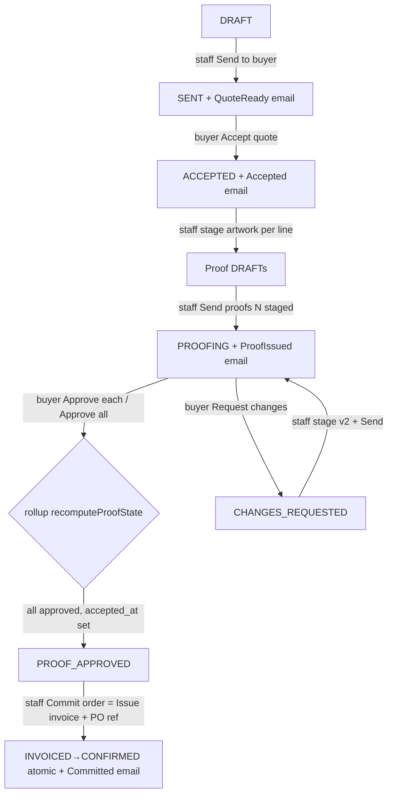

# WF-03 — Quote → Proof → Commit

**Actors:** Staff (build/send/proof/invoice) + Buyer (accept, approve proof).
**Goal:** DRAFT → SENT → ACCEPTED → PROOFING → PROOF_APPROVED → INVOICED→CONFIRMED.

## Flow

## Stages

| # | Stage | Actor | API → handler | State change / email |
|---|-------|-------|---------------|----------------------|
| 1 | Send | staff | `POST /quotes/{q}/send` → `QuoteService::send` | DRAFT→SENT, `QuoteReadyMail` |
| 2 | Accept | buyer | `POST /quotes/{q}/accept` → `accept` | SENT→ACCEPTED, sets `accepted_at`, Accepted email |
| 3 | Stage proof | staff | `POST /quotes/{q}/lines/{li}/proofs` → `stage` | Proof DRAFT (per line, versioned); no email |
| 4 | Send round | staff | `POST /quotes/{q}/proofs/send` → `sendProofs` | DRAFTs→SENT, quote→PROOFING, one ProofIssued email |
| 5 | Approve | buyer | `POST /proofs/{p}/decide` or `/proofs/approve-all` | Proof→APPROVED; rollup → PROOF_APPROVED |
| 6 | Commit | staff | `POST /quotes/{q}/invoice` → `issueInvoice` | Invoice UNPAID; INVOICED→CONFIRMED; Committed email |

## Findings touched
H5 (ACCEPTED plain-stock dead-end), H6 (drop/amend never rolls up), H4 ("Payment received" false on INVOICED), M4 (INVOICED dead UI), M6 (CHANGES_REQUESTED→DRAFT dead edge), M7 (artwork-first unreachable from DRAFT UI), M11 (rollup guard silent), M12 (buyer sees DRAFT proofs), M13 (resend wrong artwork), L1 (buyer sees state jargon), L2 (accept no guard). See [FINDINGS.md](../FINDINGS.md).

## REAL-USER TEST PROMPT

> **Two personas — staff `ops@giftlab.local` / `ChangeMe!123` and buyer `demo-buyer@example.test` / `password`.** Use the seeded PROOFING order `AVYBQQVZCX` (company 3, 3 lines) for the proof step; for the earlier states drive a fresh order if one is in DRAFT/SENT, else observe on the seeded one.
>
> **Buyer side (proof approval — main path):**
> 1. Log in as the buyer. Open `/orders/AVYBQQVZCX`. Confirm the "Review your proof" card shows one item per customized line with artwork preview + Approve / Request changes + "Approve all remaining". Screenshot.
> 2. On one line click **Request changes**, type a note, submit. Confirm that line switches to a passive "being revised" note and the order badge reflects it. Screenshot.
> 3. **Flag:** does the buyer see any proof labelled "Draft" or raw states like "Procuring/Invoiced" (M12/L1)? Do unsent proofs appear? Screenshot any leak.
>
> **Staff side (re-proof + commit):**
> 4. Log in as staff (separate session/tab). Open the same order. Stage a **revised** proof on the changed line, click **Send proofs**. Confirm it returns to PROOFING. Screenshot.
> 5. Back as buyer: **Approve all remaining**. Confirm the order rolls to **Proof approved**. Screenshot.
> 6. As staff: click **Commit order / Issue invoice**, enter a PO ref. Confirm it jumps straight to **Confirmed** (INVOICED is never shown).
> 7. **Flag:** after invoicing, does the buyer's status note say "Payment received" while nothing was paid (H4)? Does a "Pay invoice" affordance render and do nothing (M4)? Screenshot.
>
> **Also probe H5 (if a plain-stock accepted order exists):** an ACCEPTED order with **no customized lines** — confirm staff see "No customised lines to proof" with no forward control (dead-end). Note it, do not attempt to fix.
