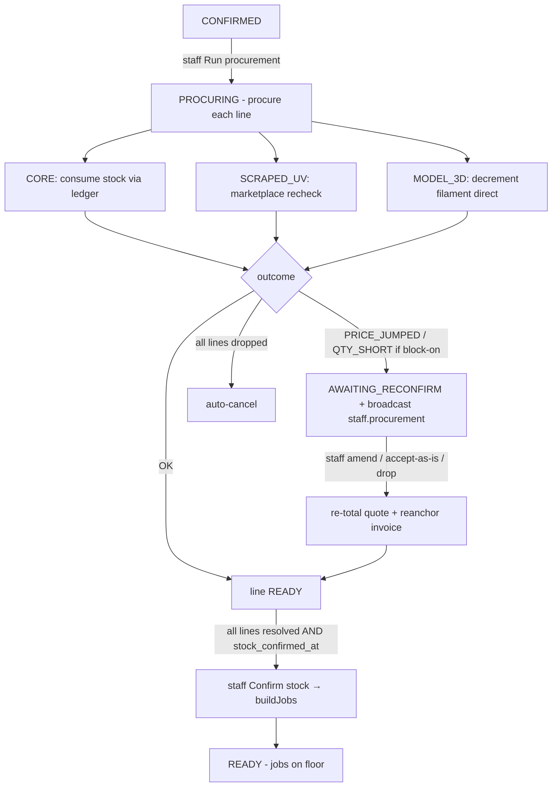

# WF-04 — Procurement

**Actor:** Staff. **Goal:** CONFIRMED → PROCURING → (reconfirm desk) → confirm-stock → jobs built → READY.

## Flow

## Stages

| # | Stage | Trigger | API → handler | Effect |
|---|-------|---------|---------------|--------|
| 1 | Run procurement | staff | `POST /quotes/{q}/procure` → `procure` | quote→PROCURING; per-line strategy |
| 2 | Reconfirm desk | staff | `GET /procurement/awaiting-reconfirm`; `POST /line-items/{li}/reconfirm` | amend / accept-as-is / drop; re-total |
| 3 | Confirm stock | staff | `POST /quotes/{q}/confirm-stock` → `confirmStock` | stamps `stock_confirmed_at`; `tryQueue` builds jobs |
| 4 | Jobs built | auto | `QueueService::buildJobsForQuote` | quote→READY; 1 UV job + N 3D jobs |

## Findings touched
M2 (accept-as-is fee re-total), M3 (3D filament ledger). Design-correct: default QTY_SHORT advisory; confirm-stock gate; all-dropped auto-cancel; ProcurementPage loads own data. See [FINDINGS.md](../FINDINGS.md).

## REAL-USER TEST PROMPT

> **Persona:** ops staff `ops@giftlab.local` / `ChangeMe!123`. Needs an order at CONFIRMED. If none seeded, first drive one there via WF-03, or use staff tools to reach CONFIRMED.
>
> 1. Log in as staff. Open a CONFIRMED order. Click **Run procurement**. Confirm the order moves to **Procuring** and per-line states update. Screenshot.
> 2. If any line lands **AWAITING_RECONFIRM**, open `/procurement`. Confirm the desk **lists the blocked line on first load** (not only via live broadcast). Screenshot.
> 3. On a qty-short customized line, choose **Accept as-is**. **Flag (M2):** check whether the quote/invoice total drops by the removed units' decoration fee, or whether the buyer keeps paying decoration for units not produced. Record the before/after totals.
> 4. Back on the order, once all lines resolved, use **Confirm stock and start production**. Confirm jobs are built and the order becomes **Ready**. Screenshot.
>
> **Flag if:** the procurement desk shows "No lines awaiting" while the order page says a line is blocked; accept-as-is over-charges (M2); a 3D/filament line's inventory behaves oddly (M3 — note, hard to see in UI); or any state can't progress.
