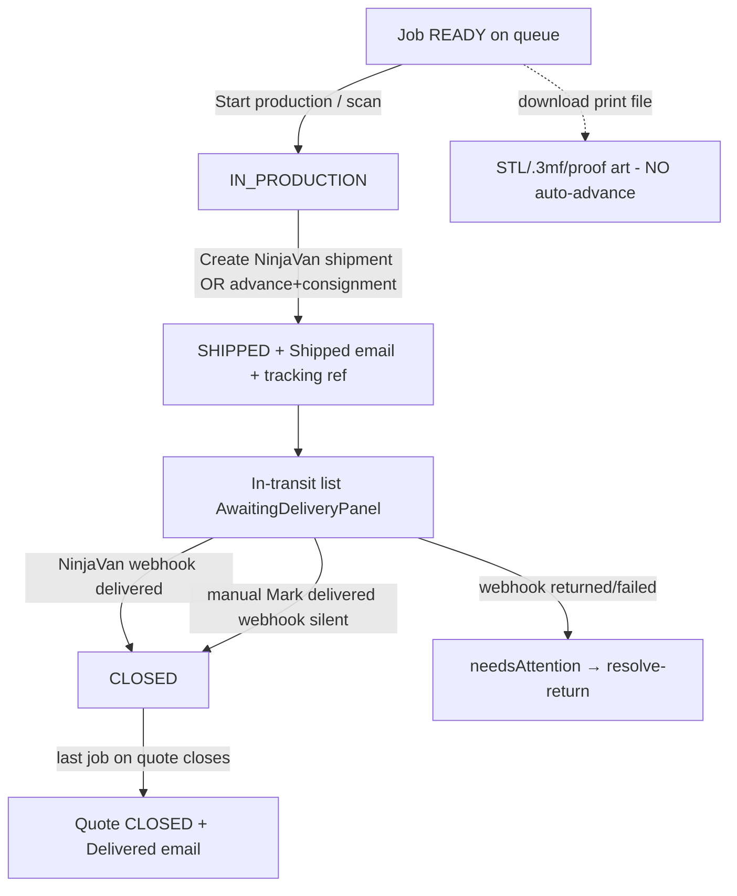

# WF-05 — Production & Shipment

**Actor:** Staff (production floor). **Goal:** READY → jobs advanced → shipment → delivered → order CLOSED.

## Flow

## Stages

| # | Stage | Trigger | API → handler | Effect |
|---|-------|---------|---------------|--------|
| 1 | Start | staff advance/scan | `POST /production-jobs/{j}/advance` or `/advance-next` or batch | READY→IN_PRODUCTION |
| 2 | Print files | staff download | `GET .../print-file`, `/print-files.zip`, `/production-file`, `/parts/{p}/model` | streams; **no state change** |
| 3 | Ship | staff | `POST .../create-shipment` → `ShipmentService` (or advance+consignment) | IN_PRODUCTION→SHIPPED, tracking ref, Shipped email |
| 4 | Deliver | webhook / manual | NinjaVan webhook, or `POST .../mark-delivered` | SHIPPED→CLOSED |
| 5 | Close order | auto | `QueueService::advance` rollup | quote READY→CLOSED when all jobs closed, Delivered email |

## Findings touched
M14 (suffix-match wrong job), M15 (cancel_credit whole-quote), M19 (multi-job multiple Shipped emails), L10–L17 (courier), L23 (create-shipment button disabled), L24 (.3mf label). See [FINDINGS.md](../FINDINGS.md).

## REAL-USER TEST PROMPT

> **Persona:** production staff `ops@giftlab.local` / `ChangeMe!123`. Needs a READY order with jobs (drive one via WF-03→WF-04 first if none seeded).
>
> 1. Log in as staff → open `/production-queue`. Confirm jobs list FCFS with per-card next-action buttons. Screenshot.
> 2. On a READY job, click **Start production**. Confirm READY→IN_PRODUCTION. Screenshot.
> 3. Download a print file (2D proof art or 3D STL/.3mf). **Flag:** confirm the job does **not** silently jump to shipped/in-production on download; confirm the `.3mf` button actually returns a file (L24). Screenshot.
> 4. On the IN_PRODUCTION job, expand the delivery address panel, then **Create NinjaVan shipment** (fixture courier in local). **Flag (L23):** was the button disabled on first load even though an address exists? Confirm SHIPPED + tracking ref appears. Screenshot.
> 5. Open the **Awaiting delivery** panel; use **Mark delivered** (webhook is silent locally). Confirm job CLOSED and, if last job, the order becomes **Closed**. Screenshot.
>
> **Note (cannot drive via UI):** the NinjaVan inbound webhook (delivered/returned) and suffix-match lookup (M14), multi-job Shipped-email duplication (M19), and cancel_credit whole-quote cancel (M15) are API/back-end paths — record them as "verified in code, not browser-testable" rather than attempting them in the UI.
