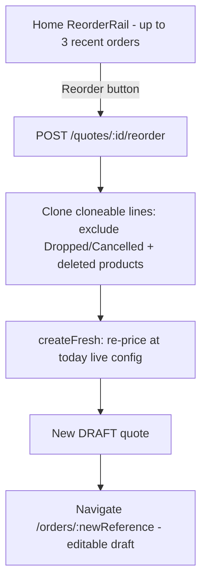

# WF-06 — Reorder

**Actor:** Buyer. **Goal:** one-click clone a past order into a fresh DRAFT, re-priced at today's config.

## Flow

## Stages

| # | Stage | Trigger | API → handler | Effect |
|---|-------|---------|---------------|--------|
| 1 | Trigger | buyer clicks Reorder | `POST /quotes/{id}/reorder` → `QuoteController::reorder` | authorize view+create |
| 2 | Clone | — | `QuoteService::reorder` | clones product_id/variant_id/qty/customization only; skips dropped/deleted-product lines |
| 3 | Re-price | — | `createFresh` | new DRAFT at today's prices; totals/GST snapshotted |
| 4 | Land | — | navigate | fresh editable DRAFT |

## Findings touched
M22 (deleted variant silently dropped), L21 (no availability/publish check), L22 (no idempotency → duplicate drafts on rapid clicks). See [FINDINGS.md](../FINDINGS.md).

## REAL-USER TEST PROMPT

> **Persona:** returning buyer `demo-buyer@example.test` / `password` (company 3, has past orders).
>
> 1. Log in as the buyer → home page. Confirm the **Reorder** rail shows recent orders (up to 3). Screenshot.
> 2. Click **Reorder** on a past order. Confirm a new **DRAFT** is created and you land on `/orders/{newReference}`. Compare the new line prices to the original — confirm they reflect **today's** config. Screenshot both.
> 3. **Flag (L22):** click Reorder twice quickly (if the button re-enables) — does it create duplicate drafts? 
> 4. **Flag (M22/L21):** if the source order had a line whose variant/product is now removed or unpublished, confirm whether it silently reappears re-priced, vanishes, or is flagged. Record what happens.
>
> **Flag if:** cloned prices don't update; dropped/cancelled lines reappear; the buyer isn't told a line changed; or an unavailable item is reorderable.
