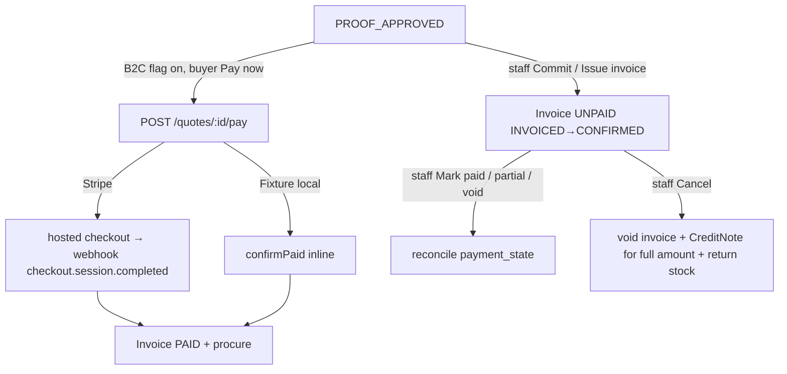

# WF-07 — Payment

**Actors:** Buyer (B2C pay-now) + Staff (B2B invoice reconcile, cancel/credit).

## Flow

## Stages

| # | Path | Trigger | API → handler | Effect |
|---|------|---------|---------------|--------|
| A | B2C pay-now | buyer | `POST /quotes/{id}/pay` → `PaymentService::payNow` | feature-gated; Stripe or fixture; Invoice PAID; auto-procure |
| B | Stripe webhook | Stripe | `POST /stripe/webhook` → `confirmPaid` | signature-verified; idempotent PO check |
| C | B2B invoice | staff | `POST /quotes/{q}/invoice` | Invoice UNPAID; INVOICED→CONFIRMED |
| D | B2B reconcile | staff | `POST /quotes/{q}/payment` | PAID/PARTIAL/VOID (no amount stored) |
| E | Cancel + credit | staff | `POST /quotes/{q}/cancel` → `voidInvoiceAndCredit` | CreditNote for **full** invoice amount |

## Findings touched
H3 (credit note over-refunds PARTIAL), H4 ("Payment received" false), M1 (pay-now not B2C-gated), M21 (PARTIAL no amount), L7–L9 (Stripe webhook / GST-hidden). See [FINDINGS.md](../FINDINGS.md).

## REAL-USER TEST PROMPT

> **Personas:** buyer `demo-buyer@example.test` / `password`; staff `ops@giftlab.local` / `ChangeMe!123`. Needs a PROOF_APPROVED order (drive via WF-03).
>
> **B2B invoice + reconcile (staff):**
> 1. Log in as staff → open a PROOF_APPROVED order → **Commit / Issue invoice** (PO ref). Confirm invoice badge = **UNPAID** and order = **Confirmed**. Screenshot.
> 2. **Flag (H4):** as buyer, view the same order — does the status note claim "Payment received" while the invoice is UNPAID? Screenshot.
> 3. As staff, **Mark partial**. **Flag (M21):** confirm no partial amount can be entered/stored — only a label + note.
> 4. As staff, **Cancel** the order. **Flag (H3):** confirm the credit note is minted for the **full** invoice amount even though only "partial" was marked. Record the credit-note amount vs what was notionally paid.
>
> **B2C pay-now (buyer):**
> 5. If `pay_now_cutoff.b2c_enabled` is on, as buyer open a PROOF_APPROVED order — confirm a **Pay now** button shows. **Flag (M1):** confirm it shows even on a B2B-style account (not gated). In local, fixture gateway confirms immediately → toast "Payment received". Screenshot.
> 6. If the flag is off, confirm Pay-now is informational only (no charge) and does not blank the page.
>
> **Note:** the real Stripe hosted page + webhook are external — verify the pre-redirect state only; back-end webhook idempotency (L7/L8) is code-verified, not browser-testable.
