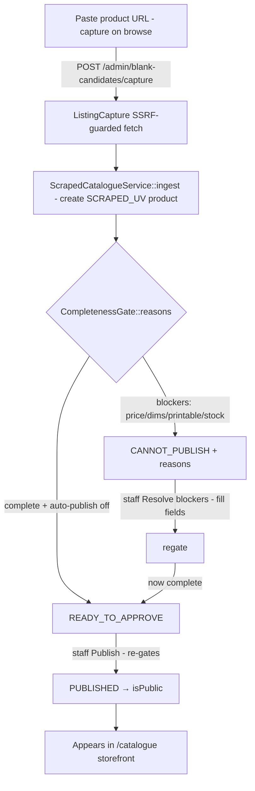

# WF-08 — Catalogue Gate (SCRAPED_UV blank lifecycle)

**Actor:** Staff. **Goal:** capture a product URL → resolve completeness blockers → publish → appears in storefront.

## Flow

## Stages

| # | Stage | Trigger | API → handler | Perm |
|---|-------|---------|---------------|------|
| 1 | Capture | paste URL | `POST /admin/blank-candidates/capture` → `AdminBlankCaptureController::store` | products.edit |
| 2 | Gate | auto | `CompletenessGate::reasons` | — |
| 3 | Resolve | fill fields | `POST /admin/products/{p}/resolve-blockers` | products.edit |
| 4 | Publish | approve | `POST /admin/products/{p}/publish` (re-gates) | products.approve |
| 5 | Live | — | `GET /catalogue` `published()` scope | public |

## Findings touched
H2 (generic PATCH bypasses gate + products.approve), M20 (blank-recommender no granular gate), L25 (CORE create self-publish), L27 (auto-publish no middleware). See [FINDINGS.md](../FINDINGS.md).

## REAL-USER TEST PROMPT

> **Persona:** catalogue staff. Use `ops@giftlab.local` / `ChangeMe!123` (staff_admin) for the gate path, and `superadmin@giftlab.local` / `ChangeMe!123` for the auto-publish toggle.
>
> 1. Log in as staff → open **Catalogue admin** (`/catalogue-admin`). Screenshot the gate list (blocked vs ready-to-approve).
> 2. Capture a new blank via the URL-capture control (use any product URL; in local the fetch may be stubbed/limited — capture the resulting draft row). Confirm it lands as **SCRAPED_UV** with blocker tags. Screenshot.
> 3. Open **Resolve blockers**: fill price, dimensions, weight, print method. Save. Confirm the item re-gates and, if complete, becomes **Ready to approve**. Screenshot.
> 4. Click **Publish**. Confirm it becomes **Published** and then appears on the public `/products` storefront. Screenshot both.
> 5. As superadmin, toggle **auto-publish** on the catalogue admin page. Confirm only superadmin sees it. Screenshot.
>
> **Flag if:** a blocked/incomplete item can reach the storefront (H2 — try editing publish state via the generic product editor and note if it bypasses the gate); the blocker copy is unclear; the storefront doesn't reflect publish immediately; or a non-superadmin sees the auto-publish toggle.
