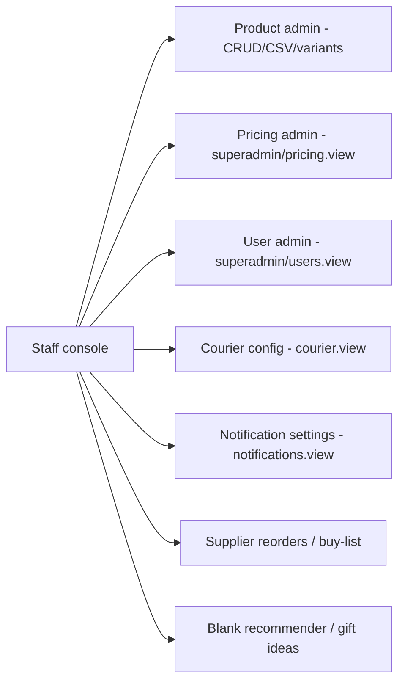

# WF-09 — Admin Ops (config surfaces)

**Actors:** Staff (delegated) / Superadmin. **Goal:** exercise the back-office config screens and their permission gates.

## Surfaces

## Stages (per surface: actor · perm · API)

| Surface | Perm (view/manage) | Key API | Notes |
|---------|--------------------|---------|-------|
| Product admin | products.view / .edit / .approve | `GET/POST/PATCH /admin/products…`, `/import`, `/variants` | CSV import = superadmin (controller) |
| Pricing | pricing.view / .manage | `GET/PATCH /admin/pricing-configs` | sensitive; superadmin delegates |
| Users | users.view / .manage | `GET/POST/PATCH /admin/users…` | escalation guards |
| Courier | courier.view / .manage | `GET/PATCH /admin/courier-config` | pickup + timeslot |
| Notifications | notifications.view / .manage | `GET/PATCH /admin/notification-settings[/cadence]` | milestone toggles + chase cadence |
| Reorders | reorders.view / .manage | `GET/POST /admin/supplier-reorders…` | receive → restock (variant only) |

## Findings touched
H1 (resetPassword takeover), M20 (blank-recommender ungated), M16/M17 (chase cadence semantics), M18 (ProofIssued dead copy), L25–L28 (admin gates), M3 (filament reorder no restock). See [FINDINGS.md](../FINDINGS.md).

## REAL-USER TEST PROMPT

> **Personas:** `superadmin@giftlab.local` / `ChangeMe!123` and `ops@giftlab.local` / `ChangeMe!123` (staff_admin).
>
> 1. As superadmin, visit each console surface: **Product admin, Pricing, Users, Courier config, Notification settings, Supplier reorders, Blank recommendations**. Confirm each loads without 403. Screenshot the console nav + one representative page.
> 2. **Notification settings:** toggle a milestone off and on; edit the chase cadence. Confirm it persists. **Flag (M18):** the "Proof issued" milestone copy — note the actual proof email uses different copy (code-verified).
> 3. **User admin:** create a `staff_admin` and grant it `users.manage` but nothing else. Log in as that staff_admin in a second session. **Flag (H1):** confirm whether it can open the superadmin user and **reset their password** (privilege-escalation risk — observe, do NOT actually take over).
> 4. **Permission mirror:** as the restricted staff_admin, confirm the nav only shows granted surfaces; try visiting `/pricing-admin` directly and confirm redirect/403 (L28).
> 5. **Courier config:** confirm pickup address + timeslot save and the timeslot is constrained to valid windows. Screenshot.
>
> **Flag if:** a delegated staff_admin can reach a sensitive surface it wasn't granted; resetPassword works on a higher-privileged user (H1); the blank-recommender lets a non-`products.*` staff seed catalogue rows (M20); or any config write silently fails.
