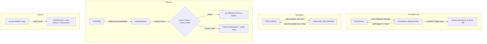

# WF-10 — Unhappy Paths

**Actors:** Staff + Buyer. **Goal:** exercise the branch/exception flows that break or surprise.

## Flows

## Findings touched
H5 (ACCEPTED plain-stock dead-end), H6 (drop/amend no rollup → stuck), M6 (CHANGES_REQUESTED→DRAFT dead edge), M11 (rollup guard silent), M14/M15 (returns), M2 (accept-as-is), L12/L13 (cancel_credit residue, reship 2nd email). See [FINDINGS.md](../FINDINGS.md).

## REAL-USER TEST PROMPT

> **Personas:** buyer `demo-buyer@example.test` / `password`; staff `ops@giftlab.local` / `ChangeMe!123`.
>
> **Changes-requested loop:**
> 1. On a PROOFING order (`AVYBQQVZCX`), as buyer **Request changes** on a line. As staff, stage a revised proof and **Send** → confirm it loops back to PROOFING cleanly. Repeat once. Screenshot. **Flag (M6):** confirm staff have **no** "pull back to draft to re-price" control from CHANGES_REQUESTED.
>
> **Dead-end probe (H6):**
> 2. On an order mid-proof with several artwork lines, as staff **drop** the last unresolved line (if a drop control exists) after siblings are approved. **Flag:** does the order advance to approved, or get stuck with no proof event able to fire? Record the resulting state.
>
> **Cancellation:**
> 3. As staff, **Cancel** a pre-production order with a reason. Confirm CANCELLED + any invoice voided. **Flag:** the cancel reason is stored but is it shown anywhere? As buyer, open the cancelled order — confirm no live Approve/Request-changes buttons remain that fail confusingly.
>
> **Returns (code-verified, not browser-drivable):** resolve-return close/reship/cancel_credit require a courier needsAttention state. Note them as code-verified: M15 (cancel_credit cancels the whole multi-job quote), L12 (cancelled job lingers in awaiting-delivery), L13 (reship sends a 2nd Shipped email).
>
> **Flag if:** any state strands with no forward control; a buyer sees actionable controls on a terminal order; or an error blanks the whole page instead of an inline message.
